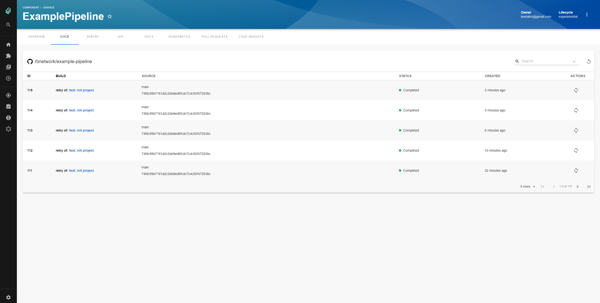

# BuildKite CI/CD Plugin for Backstage



## Features

- List BuildKite CI/CD Builds
- Retrigger builds
- Inspect each builds step in real time

## How to add BuildKite project dependency to Backstage app

If you have your own backstage application without this plugin, here it's how to add it:

1. If you have standalone app (you didn't clone this repo), then do

```bash
yarn add @roadiehq/backstage-plugin-buildkite
```

2. Add proxy config:

```yaml
// app-config.yaml
proxy:
  '/buildkite/api':
    target: https://api.buildkite.com/v2/
    headers:
      Authorization: 
        $env: BUILDKITE_TOKEN
```

3. Add plugin to the list of plugins:

```ts
// packages/app/src/plugins.ts
export { plugin as BuildKite } from '@roadiehq/backstage-plugin-buildkite';
```

4. Add plugin API to your Backstage instance:

```ts
// packages/app/src/components/catalog/EntityPage.tsx
import {
  Router as BuildKiteRouter,
  isPluginApplicableToEntity as isBuildKiteAvailable,
} from '@roadiehq/backstage-plugin-buildkite';

const CICDSwitcher = ({ entity }: { entity: Entity }) => {
  // This component is just an example of how you can implement your company's logic in entity page.
  // You can for example enforce that all components of type 'service' should use GitHubActions
  switch (true) {
    case isBuildKiteAvailable(entity):
      return <BuildKiteRouter entity={entity} />;
  ...
  }
};
```

## How to use BuildKite plugin in Backstage

BuildKite plugin is a part of the Backstage sample app. To start using it for your component, you have to:

1. Add annotation to the yaml config file of a component:

```yaml
metadata:
  annotations:
    buildkite.com/project-slug: [exampleorganization/exampleproject]
```

2. Get and provide `BUILDKITE_TOKEN` as env variable.


## Links

- [Backstage](https://backstage.io)
- [Further instructons](https://roadie.io/backstage/plugins/buildkite)
- Get hosted, managed Backstage for your company: https://roadie.io
